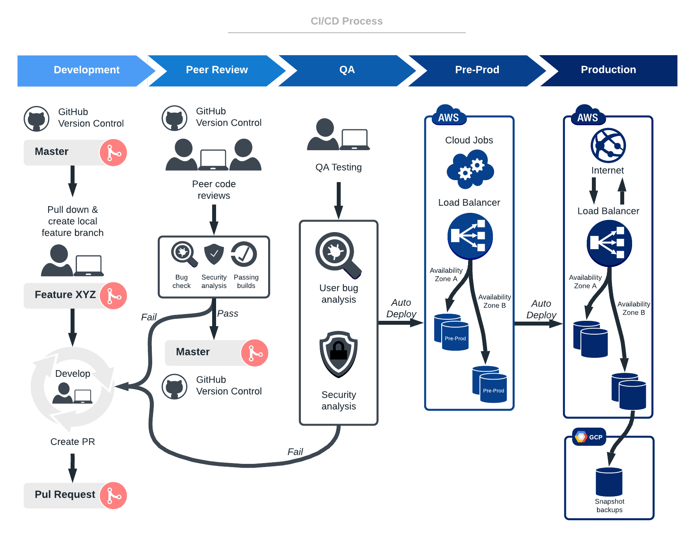

DevOps engineer merupakan seseorang yang bertanggung jawab untuk mengotomatisasi proses antara software development dan development team agar proses build, test, dan development sebuah aplikasi berjalan dengan cepat.
DevOps cukup penting di suatu perusahaan karena dengan adanya devops, proses development aplikasi dapat dilakukan dengan cepat sehingga perusahaan bisa dengan cepat mengembangkan sebuah aplikasi atau membuat aplikasi lainnya.

DevOps Flow: 

