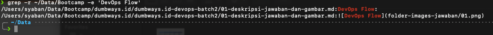

Menggunakan perintah **grep -r /path/to -e 'contain text'**

Penjelasan Command:
  - **grep** : berfungsi untuk mencari text didalam sebuah file

Penjelasan Parameter:
  - **-r** : Recursive, artinya akan mencari text sampai kedalam folder.
  - **-e** : Text yang ingin dicari 

Practice :

