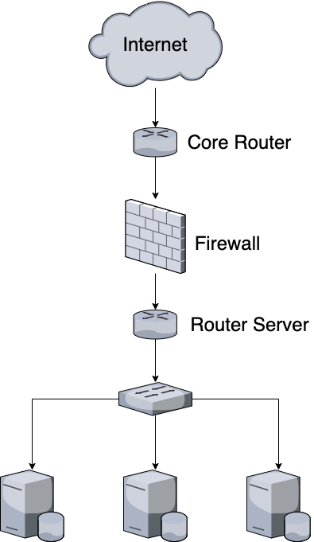

Beberapa langkah yang digunakan untuk mengamankan server:
	- Memasang firewall pada server
	- Menonaktifkan root login
	- Menonaktifkan port yang tidak digunakan
	- Mengganti port SSH
	- Memasang Monitoring Tools untuk dapat melihat traffic yang mencurigakan
	- Menggunakan SSL untuk applikasi web atau untuk Melakukan pertukaran data menggunakan FTPS
	- Menggunakan VPN untuk akses ke Server Lokal

Berikut adalah topologi yang digunakan :

Penjelassan:
	- Pada perangkat Core Router akan dikonfigurasi VPN agar yang dapat masuk atau mengakses server local hanya user yang memiliki akses vpn.
	- Pada perangkat firewall akan dilakukan block dan allow port yang masuk kedalam jaringan / request yang dilakukan menuju server.
	- Pada perangkat Router Server dapat digunakan untuk memonitoring traffic yang masuk ke Server.
	- Untuk Pengamanan pada server, dapat menggunakan langkah-langkah berikut :
		- Memasang firewall pada server
        	- Menonaktifkan root login
        	- Menonaktifkan port yang tidak digunakan
        	- Mengganti port SSH
        	- Memasang Monitoring Tools untuk dapat melihat traffic yang mencurigakan
        	- Menggunakan SSL untuk applikasi web atau untuk Melakukan pertukaran data menggunakan FTPS
