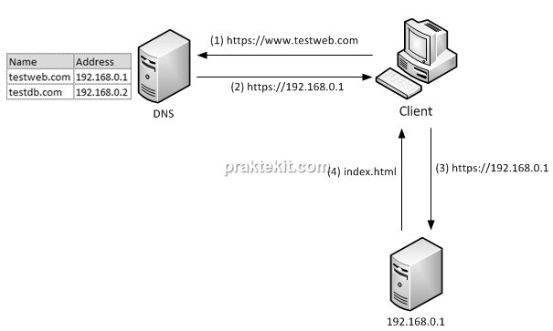

DNS merupakan Domain Name System dimana fungsinya adalah untuk menyimpan domain-doamin dari server agar ketika domain itu diakses maka akan diarahkan kepada ip server yang sudah diset di DNS Server

Cara Kerja DNS:

Seperti yang ada pada gambar diatas, cara kerja dari DNS adalah dengan memetakan ip dan domain dari ip tersebut pada server DNS, jadi ketika ada perangkat yang menggunakan IP DNS server tersebut sebagai DNS di perangkatnya dan mencoba mengakses domain yang ada pada DNS server, maka request akan dilanjutkan kepada DNS server terlebih dahulu untuk mengetahui berapa IP yang digunakan oleh domain yang ingin diakses, sehingga setelah mendapaktkan ip tersebut, request akan langsung dilanjutkan kepada server yang dituju.
